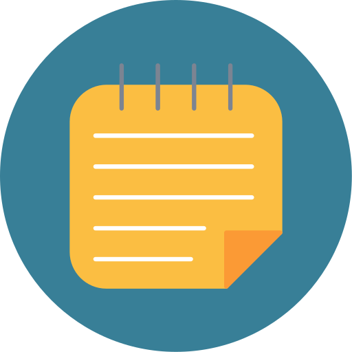

# note.ify-Bot

Note.ify is a discord bot designed to enhance the experience of live lectures and meetings. This bot is engineered to record real-time and provide concise summaries for users to reference at their convenience. Note.ify ensures that every key point is captured and presented in a well-organized format. This is mainly targeted towards the students who seek an easier and faster approach to review lecture content, but can be catered to professionals, researchers, and individuals who desires to eliminate manual-note taking. As future improvements, we plan to expand the current features in Note.ify to enhance individual’s note-taking abilities such as converting summary notes to the Cornell Note-taking Method, making flashcards, and generating potential exam questions.